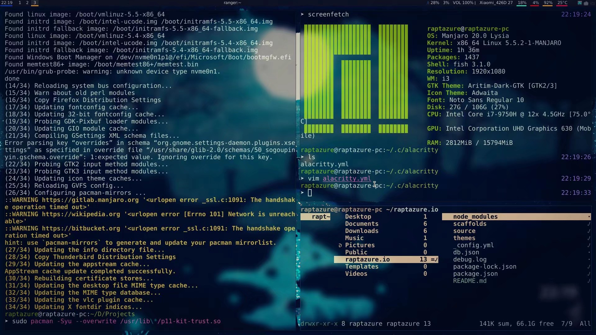

## Our Story


如果一个月以前的我没有决定安装 Linux + Windows 双系统的话，也许我还不知道 vim key binding 的高效，也许我还不知道怎么用 git，也许我还不会产生用 TypeScript 给 VS Code 写个插件的想法... 在这一个多月的时间里，从一开始的 KDE 桌面折腾到 i3wm，从默认的 shell 折腾到 fish + omf，从自带的 terminal emulator 折腾到 alacritty... 在编写各种配置文件，完成各种个性化定制的同时，我也熟悉并喜欢上了命令行环境的简洁高效，喜欢上了通过社区发现并解决问题的过程，并也想为开源社区做些什么。确实，各种环境配置在某种程度上很费时间，经常熬夜修改各种环境错误，在 GitHub Issue 区到处寻找解答，但在这一个月里，我与计算机之间的距离仿佛被无限拉近，不如说，这也算是某种缘分吧。


## Some Notes

- 切换镜像源：  
  `sudo pacman-mirrors -i -c China -m rank`   
  `sudo pacman -Syy` `sudo vim /etc/pacman.conf`
  ```
  [archlinuxcn]
  SigLevel = Optional TrustedOnly
  Server = https://mirrors.sjtug.sjtu.edu.cn/archlinux-cn/$arch
  ```
  `sudo pacman -S archlinuxcn-keyring` `sudo pacman -Syyu`
- 安装输入法：`yay -S ibus-rime`  
  `ibus-setup`，选择 Input > Add > Chinese > Rime  
  `vim ~/.xprofile`
  ```
  export GTK_IM_MODULE=ibus
  export XMODIFIERS=@im=ibus
  export QT_IM_MODULE=ibus
  ibus-daemon -x -d
  ```

- Fix Crackling and popping sound when using headphones: `pactl unload-module module-suspend-on-idle`
- 运行 `curl --proto '=https' --tlsv1.2 -sSf https://sh.rustup.rs | sh` 时报错 `curl: (35) OpenSSL SSL_connect: SSL_ERROR_SYSCALL in connection to sh.rustup.rs:443`，关闭当前网络的 IPv6 连接之后重试。
- 代理：使用 [Clashy](https://github.com/SpongeNobody/Clashy) 和 [CordCloud](https://www.cordcloud.site/)，终端设置可以直接 export。
- TIM on i3wm: `sudo pacman -S deepin.com.qq.office`

  ​ 1. install `gnome-settings-daemon`  
  ​ 2. run `nohup /usr/lib/gsd-xsettings > /dev/null 2>&1 &`  
  ​ 3. execute `./opt/deepinwine/apps/Deepin-TIM/run.sh`

- My [dotfiles](https://github.com/raptazure/dotfiles) on GitHub.
  
## Appendix

- `fish` - A smart and user-friendly command shell for Linux.

- `oh-my-fish` - A fishshell framework that allows you to install packages which extend or modify the look and feel of your shell.

- `alacritty` - A free open-source, fast, cross-platform terminal emulator, that uses GPU (Graphics Processing Unit) for rendering. Alacritty is focused on two goals simplicity and performance.

- `ranger` - A lightweight and powerful file manager that works in a terminal window and it comes with vi/vim key bindings!

- `albert` - Access everything with virtually zero effort. Run applications, open files or their paths, open bookmarks in your browser, search the web, calculate things and a lot more … It is a desktop agnostic launcher and its goals are usability and beauty.

- `dmenu` - A fast and lightweight dynamic menu for X. It reads arbitrary text from stdin, and creates a menu with one item for each line. The user can then select an item, through the arrow keys or typing a part of the name, and the line is printed to stdout.

- `variety` - A wallpaper manager for Linux systems. It supports numerous desktops and wallpaper sources, including local files and online services: Flickr, Wallhaven, Unsplash, and more.

- `polybar` - A fast and easy-to-use tool for creating status bars. Polybar aims to help users build beautiful and highly customizable status bars.

- `compton` - A compositor for X.

- `neovim` - Hyperextensible Vim-based text editor.
