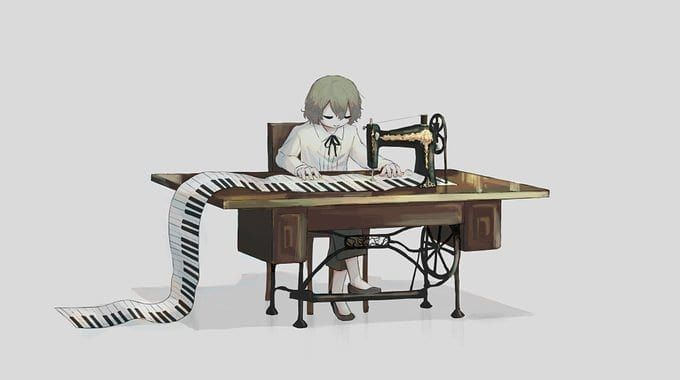

> 细碎，回环，和谐，清冷，朴素，宁静。

接触到这种类型的音乐时，我还在高二，听着 Ludovico Einaudi 的钢琴曲看 [Art](https://www.springer.com/gp/book/9780387954684) 或是写福山机理，已经成为了当时至高的享受。每当戴上耳机，捧起书本，就仿佛独自徘徊于一个感性所搭建的理性世界，并不浓烈却又极具生命力的音符漂浮在周围的空气中，似乎在诉说着无数电子流动或是自由基相遇的故事。

而现在，虽然手中捧着的书早已不再是有机化学，但那些音符依然在时间的长河中流淌着。依旧简约而优雅，依旧沉静却灵动，依旧细碎但温暖，与手下键盘的跃动一起，写进了一个个 functor, applicative 和 monad。说到这里，突然觉得，拥有优雅表达的极简主义音乐，似乎和 Functional Programming 有些相像呢。然而，不管是极简主义音乐还是包括它的新古典音乐，都是比较小众的，很多人无法享受到这份美，虽然不能说这是坏事，但却是一种遗憾。于是，在属于自己的空间里，感受着熟悉却又多变的音色，我写下这些文字。

极简主义音乐 (Minimalist music) 是新古典音乐 (Contemporary classical music) 下的一支，而后者则可以理解为当今的古典音乐。在二十世纪初，一些古典音乐的作曲者们为抵制后期浪漫主义的夸张表现和无形式感，采用了新古典主义风格，开始尝试一种越来越“不和谐”的表达方式，不再注重曲子的旋律，而力图重现早期风格中的平衡形式和清晰主题。第二次世界大战后，现代主义作曲家试图在创作过程中使用序列主义等来达到更高的控制水平，但与此同时，作曲家们也尝试了放弃控制的手段来探索不确定性或无意识的过程。在这一次次指向不同的实验中，关于 tape loops 和 repetitive textures 的尝试促成了极简主义的到来。

所谓极简，其实是指运用尽量少的音乐材料，在重复中对其加以变化，使之不断发展延续，和谐渐变。这些重复的乐句，随着时间产生分支，从而引入了无穷的层次感。起或是落，递进或是舒缓，都在这一次次的循环中得以诠释。但是，在旋律复杂度极低的同时，其中的音色却是丰富的，时而细碎急速，时而沉重缓慢，时而晶莹剔透，时而沧桑荒凉。所有音符各自分离，却构成了同一个整体，周而复始但又富含生机与灵气，在这精密而微妙的组成中，每一个乐段都不可或缺，就像每一个生命都有其存在的价值。

极简主义音乐容易使人产生画面感，沉溺于思考或是幻想的世界，同时也很适合作为电影配乐。它朴素，宁静，随时间流淌，仿佛在讲述着无穷的故事，又仿佛只是沉默地立在那里。《天使爱美丽》中的「La Valse D'Amélie」就是一个不错的例子，既然类别相同，那么有人听到 Fabrizio Paterlini 的「Rue des trois frères」时会联想到这部电影也就不奇怪了。

每当描述音乐的时候，总会感觉文字过于贫瘠，无法详尽描述置身其中的感觉，更无法叙述所有涌上心头的情感。所以极简主义到底是一种怎样的风格，总归还是要自己感受。

在音符与时间的流动中，在一片简单的静谧里，去体会吧。

最后附一张[纪念性截图](https://cdn.jsdelivr.net/gh/raptazure/cdn/2020/twitter.png)和两个有趣的视频：

- [How to play "Minimalmusic" from Andreas Wolter](https://youtu.be/itZ95L-T4dE)
- [How to play piano like Philip Glass](https://youtu.be/nNiOqa1nWgI)
